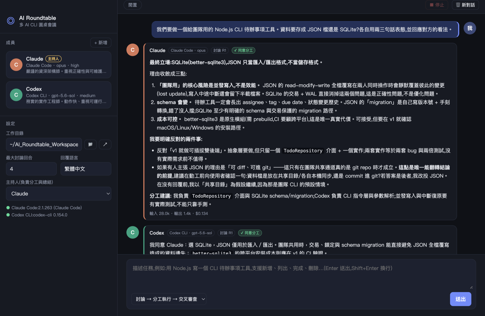

[繁體中文](README.md) | **English**

# AI Roundtable

A macOS desktop app that seats multiple AI coding CLIs (Claude Code, Codex CLI, Cursor CLI, or any custom command) at one table to discuss a task, divide the work, execute it, and review each other.

> Members debate a task, split the work, execute in parallel, and review each other's output. You watch the whole conversation live and can jump in at any time.



## Features

- **Several AIs at one table**: Claude Code, Codex CLI and Cursor CLI are built in; Grok, Kimi, DeepSeek, Gemini, OpenRouter, Ollama and more can be added from templates in one click.
- **Extensible**: describe any CLI or OpenAI-compatible API in JSON, or write a JS plugin; edit and reload extensions inside the app.
- **Per-member settings**: role and personality, model, reasoning effort, and whether the member may edit files.
- **Discuss → divide → execute in parallel → cross-review → summarize**, streamed live, including tool calls and thinking.
- **Interject any time**: messages sent while a task runs are shown to the next member to speak.
- **@-mention a member**: type `@Name` so only that member replies or acts, skipping the discussion flow; several members at once run in parallel.
- **Attachments**: drag and drop or click 📎 to attach images, text files or PDFs; each member gets a file path or inline content depending on its capabilities.
- **History**: every task is saved when it ends; preview, export to Markdown, or "Resume this conversation" to keep discussing.
- **Side-by-side parallel replies**: in parallel phases such as execution and review, member messages sit three to a row.
- **Usage totals**: input, cached, output tokens and cost normalized across CLIs and APIs.
- **Interface language**: Traditional Chinese and English, optionally following the system; system messages, member prompts and exports switch with it.
- **Uses the CLI subscriptions you already have**; no extra API keys needed. Keys for API members are encrypted with the operating system's secure storage.

## Requirements

- macOS (other platforms are untested)
- Node.js 20 or newer
- At least one AI source:
  - [Claude Code](https://docs.anthropic.com/en/docs/claude-code), [Codex CLI](https://github.com/openai/codex) or [Cursor CLI](https://cursor.com/cli) (`cursor-agent`), installed and logged in
  - or any other CLI / API through an extension

## Quick start

```bash
git clone https://github.com/yanmin841111-byte/ai-roundtable.git
cd ai-roundtable
npm install
npm start
```

The bottom-left corner shows the CLIs it detected and their versions. If one is missing, make sure the command is on the `PATH` of your login shell.

To package a .dmg:

```bash
npm run dist
```

The output is `release/AI Roundtable-<version>-arm64.dmg` (Apple Silicon) and `-x64.dmg` (Intel). You can also download them from [Releases](https://github.com/yanmin841111-byte/ai-roundtable/releases). There is no Apple developer certificate, so the app is only ad-hoc signed and not notarized; the first time, macOS says the developer cannot be verified. Click Done, then open System Settings → Privacy & Security, click "Open Anyway" at the bottom and confirm (on macOS 14 and earlier, right-click the app in Finder → Open also works). After that it opens normally.

## How a task runs

After you send a task, depending on the mode:

- **Discuss → Divide & execute → Cross-review**
  1. Members speak in turn, each seeing everything said before. A member who thinks there is agreement ends its reply with `[AGREED]`; when everyone agrees in the same round the work is divided, otherwise division is forced once "Max discussion rounds" is reached.
  2. The lead outputs a JSON work plan, keeping each member on different files where possible.
  3. All members execute their part **in parallel** in the working directory.
  4. Each member reviews the next member's work (it actually opens the files).
  5. The lead summarizes.
- **Discuss only, no execution**: after agreement or the round limit, the lead summarizes.

When a message contains `@Name`, only the mentioned members reply (in parallel if there are several). If you mention someone while a task is running, they see the message on their next turn; if they do not get a turn before the task ends, they reply once at the end.

You can send messages at any time while a task runs; they are shown to the next member to speak. "Stop" terminates every CLI process. "New chat" clears the conversation and each member's session memory.

## Member settings

Click a member card in the sidebar to edit it:

| Field | Description |
| --- | --- |
| AI CLI | Built-in Claude Code, Codex CLI, Cursor CLI, custom command, or an extension you added |
| Model / version | Read from each CLI's local model cache; only current, non-retired models are listed. Choose "Other" to type any model name |
| Effort | Options depend on the model; unsupported levels are lowered to the nearest supported one or skipped, and noted in the conversation |
| Role and personality | Goes into the system prompt and sets the member's stance and tone |
| Allow editing files | When on, Claude runs with `--dangerously-skip-permissions`, Codex with `workspace-write`, Cursor with `--force`; when off, read-only (Cursor uses `--mode ask`) |
| Custom command | The prompt goes to stdin and stdout is the reply; `{model}` and `{effort}` are available, e.g. `gemini -m {model} -p -` |

The lead is chosen in Settings and is responsible for dividing the work and summarizing.

## Adding other CLIs and APIs

Bottom-left "⚙ Settings" → "CLIs & extensions" → "+ Add" adds another AI from a template:

| Template | Type | Needs |
| --- | --- | --- |
| Grok CLI, Kimi Code CLI, Gemini CLI | CLI | The CLI installed |
| DeepSeek, Kimi (Moonshot), Grok (xAI), OpenRouter | API | An API key (entered in the extension editor, or an environment variable) |
| Ollama | API | Ollama running locally |
| Blank CLI, blank API, Aider JS plugin | Custom | Fill it in yourself |

- API members can only discuss and review; they cannot edit files.
- When a definition is wrong, the settings page and the editor show the reason.
- The CLI templates follow the official docs and have not all been tested against the real CLIs.

Every field is described in [docs/adapters.en.md](docs/adapters.en.md).

## Model lists

Model list logic lives in `src/models.ts`; aliases and effort rules in `src/model-rules.ts` (shared by the main process and the interface).

- Claude Code: `~/.claude/cache/model-catalog/*.json`, models whose `section` is `main`; with several files, the newest valid one wins.
- Codex: `~/.codex/models_cache.json`, excluding models whose `visibility` is not `list` or that have an `upgrade` (retired).
- Cursor CLI: runs `cursor-agent --list-models`, refreshed every 10 minutes. Cursor encodes effort in the model name (e.g. `claude-opus-5-thinking-high`), so there is no separate effort setting.
- Results are cached by file modification time and not re-read while the file is unchanged; the member editor re-fetches every time it opens, so an updated CLI cache is picked up without restarting.
- If no cache can be read, a built-in list is used and the editor says so.

## Attachments

Drag files onto the input box or click 📎. Supported: png / jpg / webp / gif / txt / md / json / csv / log / pdf. Defaults: at most 10 files per message, 20 MB per file, 50 MB in total. Validation happens in the main process (extension and file content are both checked).

Attachments are stored in the app's data folder, never in the working directory. How they reach a member depends on its capabilities:

- Local CLIs get the file path and read it themselves. CLIs with a restricted read scope (Claude Code, Gemini CLI) get a temporary copy under `.roundtable-runtime/` in the working directory, removed when the task ends, is stopped, or the app quits.
- APIs get text files inline; endpoints that declare image support get images attached, with an automatic text-only retry if the image is rejected. PDFs go only to CLIs that can read files; API members are told they cannot read them.

## Memory

Claude resumes with `--resume <session_id>`, Codex with `codex exec resume <thread_id>`, Cursor with `--resume <chatId>`, so later turns send only the new messages and save tokens. OpenAI-compatible APIs keep the conversation history in app memory. Custom commands have no session, so they get the full transcript every turn, capped by "Transcript limit".

CLI sessions are not written to history. When you resume a saved conversation, each member's first turn receives the full transcript truncated to the limit (the original task is always kept), after which only new messages are sent again.

## ⚠️ Security notes

Extensions run commands with your user account's permissions, and JS plugins have full Node.js access. Only install extensions you trust.

With "Allow editing files and running commands" on, Claude Code runs with `--dangerously-skip-permissions`, Codex runs in the `workspace-write` sandbox without confirmation prompts, and Cursor CLI auto-approves commands with `--force`. The AI can create, modify and delete files and run commands inside the working directory.

- Use a dedicated folder as the working directory; do not point it at an important project or your home directory.
- API keys entered in the extension editor are encrypted with the operating system's secure storage (the macOS keychain) and saved in `secrets.json`; they are never written to the extension JSON. A plain-text `apiKey` left in an extension file by older versions is migrated automatically on load.
- Keep the working directory under git so you can inspect and revert what the AI did.
- If you only want to watch a discussion, turn the option off or use "Discuss only, no execution".

## Notes

- Every CLI uses your existing login and subscription quota, and multi-round discussions burn through it quickly. Use a cheaper model and lower effort for discussion, and raise the effort for execution; when only one member is needed, use `@Name` instead of the full flow.
- Parallel execution can still conflict when several members edit the same file; the division prompt asks the lead to avoid overlap, but for complex tasks keep the working directory under git.

## Data locations

Everything is under `~/Library/Application Support/AI Roundtable/`; `sessions/` and `adapters/` can be opened from "Settings → Data & logs":

| Path | Contents |
| --- | --- |
| `config.json` | Members and settings |
| `sessions/` | Conversation logs (one JSON per conversation) |
| `attachments/` | Attachments, removed together with their conversation log |
| `adapters/` | Extension definitions |
| `secrets.json` | Encrypted API keys |

## Project layout

| Path | Description |
| --- | --- |
| `main.ts`, `preload.ts` | Electron main process and the IPC bridge |
| `src/ipc-types.ts`, `renderer/api.d.ts` | IPC types shared by the main process and the interface |
| `renderer/` | The interface (HTML / CSS / TypeScript, bundled by esbuild) |
| `src/orchestrator.ts` | Discussion, division, execution, review and @-mention flow |
| `src/adapters/` | Built-in adapters, extension loading, generic CLI / API adapters |
| `src/attachments.ts`, `src/session-log.ts`, `src/secrets.ts` | Attachments, history, API key storage |
| `src/models.ts`, `src/model-rules.ts`, `src/usage.ts` | Model lists, effort rules, usage normalization |
| `adapters/templates/` | Extension templates shown under "+ Add" |
| `docs/` | Extension guide and interface copy spec |
| `test/` | Tests run by `npm test`; `test/e2e/` is the end-to-end run |
| `dist/` | Output of `npm run build`, which is what the app loads (not committed) |

## Contributing

Issues and pull requests are welcome; see [CONTRIBUTING.en.md](CONTRIBUTING.en.md). Report security problems privately as described in [SECURITY.en.md](SECURITY.en.md). Changes are listed in [CHANGELOG.en.md](CHANGELOG.en.md).

## License

[MIT](LICENSE)
